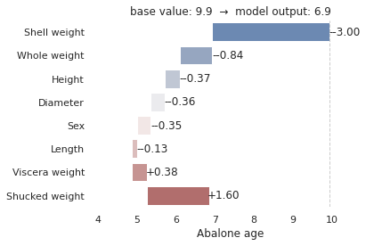
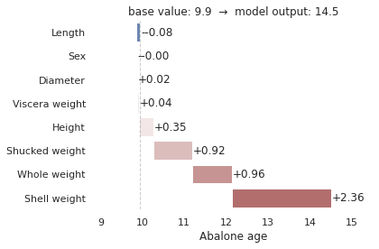

```python
!pip3 install -U sagemaker
```

    Looking in indexes: https://pypi.org/simple, https://pip.repos.neuron.amazonaws.com
    Requirement already satisfied: sagemaker in /home/ec2-user/anaconda3/envs/python3/lib/python3.8/site-packages (2.101.1)
    Collecting sagemaker
      Downloading sagemaker-2.104.0.tar.gz (566 kB)
         ━━━━━━━━━━━━━━━━━━━━━━━━━━━━━━━━━━━━━━ 566.7/566.7 KB 10.5 MB/s eta 0:00:0000:01
    [?25h  Preparing metadata (setup.py) ... [?25ldone
    [?25hRequirement already satisfied: attrs<22,>=20.3.0 in /home/ec2-user/anaconda3/envs/python3/lib/python3.8/site-packages (from sagemaker) (21.2.0)
    Requirement already satisfied: boto3<2.0,>=1.20.21 in /home/ec2-user/anaconda3/envs/python3/lib/python3.8/site-packages (from sagemaker) (1.24.42)
    Requirement already satisfied: google-pasta in /home/ec2-user/anaconda3/envs/python3/lib/python3.8/site-packages (from sagemaker) (0.2.0)
    Requirement already satisfied: numpy<2.0,>=1.9.0 in /home/ec2-user/anaconda3/envs/python3/lib/python3.8/site-packages (from sagemaker) (1.20.3)
    Requirement already satisfied: protobuf<4.0,>=3.1 in /home/ec2-user/anaconda3/envs/python3/lib/python3.8/site-packages (from sagemaker) (3.19.1)
    Requirement already satisfied: protobuf3-to-dict<1.0,>=0.1.5 in /home/ec2-user/anaconda3/envs/python3/lib/python3.8/site-packages (from sagemaker) (0.1.5)
    Requirement already satisfied: smdebug_rulesconfig==1.0.1 in /home/ec2-user/anaconda3/envs/python3/lib/python3.8/site-packages (from sagemaker) (1.0.1)
    Requirement already satisfied: importlib-metadata<5.0,>=1.4.0 in /home/ec2-user/anaconda3/envs/python3/lib/python3.8/site-packages (from sagemaker) (4.8.2)
    Requirement already satisfied: packaging>=20.0 in /home/ec2-user/anaconda3/envs/python3/lib/python3.8/site-packages (from sagemaker) (21.3)
    Requirement already satisfied: pandas in /home/ec2-user/anaconda3/envs/python3/lib/python3.8/site-packages (from sagemaker) (1.3.4)
    Requirement already satisfied: pathos in /home/ec2-user/anaconda3/envs/python3/lib/python3.8/site-packages (from sagemaker) (0.2.8)
    Requirement already satisfied: s3transfer<0.7.0,>=0.6.0 in /home/ec2-user/anaconda3/envs/python3/lib/python3.8/site-packages (from boto3<2.0,>=1.20.21->sagemaker) (0.6.0)
    Requirement already satisfied: jmespath<2.0.0,>=0.7.1 in /home/ec2-user/anaconda3/envs/python3/lib/python3.8/site-packages (from boto3<2.0,>=1.20.21->sagemaker) (0.10.0)
    Collecting botocore<1.28.0,>=1.27.42
      Downloading botocore-1.27.55-py3-none-any.whl (9.1 MB)
         ━━━━━━━━━━━━━━━━━━━━━━━━━━━━━━━━━━━━━━━━ 9.1/9.1 MB 31.9 MB/s eta 0:00:00:00:0100:01
    [?25hRequirement already satisfied: zipp>=0.5 in /home/ec2-user/anaconda3/envs/python3/lib/python3.8/site-packages (from importlib-metadata<5.0,>=1.4.0->sagemaker) (3.6.0)
    Requirement already satisfied: pyparsing!=3.0.5,>=2.0.2 in /home/ec2-user/anaconda3/envs/python3/lib/python3.8/site-packages (from packaging>=20.0->sagemaker) (3.0.6)
    Requirement already satisfied: six in /home/ec2-user/anaconda3/envs/python3/lib/python3.8/site-packages (from protobuf3-to-dict<1.0,>=0.1.5->sagemaker) (1.16.0)
    Requirement already satisfied: python-dateutil>=2.7.3 in /home/ec2-user/anaconda3/envs/python3/lib/python3.8/site-packages (from pandas->sagemaker) (2.8.2)
    Requirement already satisfied: pytz>=2017.3 in /home/ec2-user/anaconda3/envs/python3/lib/python3.8/site-packages (from pandas->sagemaker) (2021.3)
    Requirement already satisfied: dill>=0.3.4 in /home/ec2-user/anaconda3/envs/python3/lib/python3.8/site-packages (from pathos->sagemaker) (0.3.4)
    Requirement already satisfied: multiprocess>=0.70.12 in /home/ec2-user/anaconda3/envs/python3/lib/python3.8/site-packages (from pathos->sagemaker) (0.70.12.2)
    Requirement already satisfied: pox>=0.3.0 in /home/ec2-user/anaconda3/envs/python3/lib/python3.8/site-packages (from pathos->sagemaker) (0.3.0)
    Requirement already satisfied: ppft>=1.6.6.4 in /home/ec2-user/anaconda3/envs/python3/lib/python3.8/site-packages (from pathos->sagemaker) (1.6.6.4)
    Requirement already satisfied: urllib3<1.27,>=1.25.4 in /home/ec2-user/anaconda3/envs/python3/lib/python3.8/site-packages (from botocore<1.28.0,>=1.27.42->boto3<2.0,>=1.20.21->sagemaker) (1.26.8)
    Building wheels for collected packages: sagemaker
      Building wheel for sagemaker (setup.py) ... [?25ldone
    [?25h  Created wheel for sagemaker: filename=sagemaker-2.104.0-py2.py3-none-any.whl size=782461 sha256=5ad7035ed0dc77b44379bbd7d0925ff0319669a268d6bc72287d4cb3ff05efb8
      Stored in directory: /home/ec2-user/.cache/pip/wheels/ac/c9/3e/ddfd1cda6448ba8bdf089dd2e5099673abb4b278fb145608ff
    Successfully built sagemaker
    Installing collected packages: botocore, sagemaker
      Attempting uninstall: botocore
        Found existing installation: botocore 1.24.19
        Uninstalling botocore-1.24.19:
          Successfully uninstalled botocore-1.24.19
      Attempting uninstall: sagemaker
        Found existing installation: sagemaker 2.101.1
        Uninstalling sagemaker-2.101.1:
          Successfully uninstalled sagemaker-2.101.1
    ERROR: pip's dependency resolver does not currently take into account all the packages that are installed. This behaviour is the source of the following dependency conflicts.
    awscli 1.25.42 requires botocore==1.27.42, but you have botocore 1.27.55 which is incompatible.
    aiobotocore 2.0.1 requires botocore<1.22.9,>=1.22.8, but you have botocore 1.27.55 which is incompatible.
    Successfully installed botocore-1.27.55 sagemaker-2.104.0
    WARNING: You are using pip version 22.0.4; however, version 22.2.2 is available.
    You should consider upgrading via the '/home/ec2-user/anaconda3/envs/python3/bin/python -m pip install --upgrade pip' command.
    


```python
%%time

import io
import os
import boto3
import sagemaker
import time

role = sagemaker.get_execution_role()
region = boto3.Session().region_name

# S3 bucket for saving code and model artifacts.
# Feel free to specify a different bucket here if you wish.
bucket = sagemaker.Session().default_bucket()
prefix = "sagemaker/DEMO-xgboost-inference-script-mode"
```

    CPU times: user 971 ms, sys: 172 ms, total: 1.14 s
    Wall time: 18.6 s


```python
%%time
s3 = boto3.client("s3")
# Load the dataset
FILE_DATA = "abalone"
s3.download_file(
    "sagemaker-sample-files", f"datasets/tabular/uci_abalone/abalone.libsvm", FILE_DATA
)
sagemaker.Session().upload_data(FILE_DATA, bucket=bucket, key_prefix=prefix + "/train")
```

    CPU times: user 151 ms, sys: 15.6 ms, total: 167 ms
    Wall time: 976 ms


    's3://sagemaker-us-west-1-167762637358/sagemaker/DEMO-xgboost-inference-script-mode/train/abalone'


```python
from sagemaker.inputs import TrainingInput
from sagemaker.xgboost.estimator import XGBoost

job_name = "DEMO-xgboost-inference-script-mode-" + time.strftime("%Y-%m-%d-%H-%M-%S", time.gmtime())
print("Training job", job_name)

hyperparameters = {
    "max_depth": "5",
    "eta": "0.2",
    "gamma": "4",
    "min_child_weight": "6",
    "subsample": "0.7",
    "objective": "reg:squarederror",
    "num_round": "50",
    "verbosity": "2",
}

instance_type = "ml.c5.xlarge"

xgb_script_mode_estimator = XGBoost(
    entry_point="abalone.py",
    hyperparameters=hyperparameters,
    role=role,
    instance_count=1,
    instance_type=instance_type,
    framework_version="1.5-1",
    output_path="s3://{}/{}/{}/output".format(bucket, prefix, job_name),
)

content_type = "text/libsvm"
train_input = TrainingInput(
    "s3://{}/{}/{}/".format(bucket, prefix, "train"), content_type=content_type
)
```

    Training job DEMO-xgboost-inference-script-mode-2022-08-18-20-51-25


```python
xgb_script_mode_estimator.fit({"train": train_input, "validation": train_input}, job_name=job_name)
```

    2022-08-18 20:53:40 Starting - Starting the training job...
    2022-08-18 20:53:55 Starting - Preparing the instances for trainingProfilerReport-1660856020: InProgress
    ......
    2022-08-18 20:55:09 Downloading - Downloading input data...
    2022-08-18 20:55:38 Training - Downloading the training image.....[2022-08-18 20:56:18.701 ip-10-0-180-2.us-west-1.compute.internal:1 INFO utils.py:27] RULE_JOB_STOP_SIGNAL_FILENAME: None
    [2022-08-18:20:56:18:INFO] Imported framework sagemaker_xgboost_container.training
    [2022-08-18:20:56:18:INFO] No GPUs detected (normal if no gpus installed)
    [2022-08-18:20:56:18:INFO] Invoking user training script.
    [2022-08-18:20:56:19:INFO] Module abalone does not provide a setup.py. 
    Generating setup.py
    [2022-08-18:20:56:19:INFO] Generating setup.cfg
    [2022-08-18:20:56:19:INFO] Generating MANIFEST.in
    [2022-08-18:20:56:19:INFO] Installing module with the following command:
    /miniconda3/bin/python3 -m pip install . 
    Processing /opt/ml/code
      Preparing metadata (setup.py): started
      Preparing metadata (setup.py): finished with status 'done'
    Building wheels for collected packages: abalone
      Building wheel for abalone (setup.py): started
      Building wheel for abalone (setup.py): finished with status 'done'
      Created wheel for abalone: filename=abalone-1.0.0-py2.py3-none-any.whl size=5714 sha256=0dfd94cd1fdeb5cbd3d08d6b34bc4a403e39e793e200bc99e9a21fe8eeed610c
      Stored in directory: /home/model-server/tmp/pip-ephem-wheel-cache-mwg1ueyv/wheels/f3/75/57/158162e9eab7af12b5c338c279b3a81f103b89d74eeb911c00
    Successfully built abalone
    Installing collected packages: abalone
    Successfully installed abalone-1.0.0
    WARNING: Running pip as the 'root' user can result in broken permissions and conflicting behaviour with the system package manager. It is recommended to use a virtual environment instead: https://pip.pypa.io/warnings/venv
    [notice] A new release of pip available: 22.1.2 -> 22.2.2
    [notice] To update, run: pip install --upgrade pip
    [2022-08-18:20:56:23:INFO] No GPUs detected (normal if no gpus installed)
    [2022-08-18:20:56:23:INFO] Invoking user script
    Training Env:
    {
        "additional_framework_parameters": {},
        "channel_input_dirs": {
            "train": "/opt/ml/input/data/train",
            "validation": "/opt/ml/input/data/validation"
        },
        "current_host": "algo-1",
        "framework_module": "sagemaker_xgboost_container.training:main",
        "hosts": [
            "algo-1"
        ],
        "hyperparameters": {
            "eta": "0.2",
            "gamma": "4",
            "max_depth": "5",
            "min_child_weight": "6",
            "num_round": "50",
            "objective": "reg:squarederror",
            "subsample": "0.7",
            "verbosity": "2"
        },
        "input_config_dir": "/opt/ml/input/config",
        "input_data_config": {
            "train": {
                "ContentType": "text/libsvm",
                "TrainingInputMode": "File",
                "S3DistributionType": "FullyReplicated",
                "RecordWrapperType": "None"
            },
            "validation": {
                "ContentType": "text/libsvm",
                "TrainingInputMode": "File",
                "S3DistributionType": "FullyReplicated",
                "RecordWrapperType": "None"
            }
        },
        "input_dir": "/opt/ml/input",
        "is_master": true,
        "job_name": "DEMO-xgboost-inference-script-mode-2022-08-18-20-51-25",
        "log_level": 20,
        "master_hostname": "algo-1",
        "model_dir": "/opt/ml/model",
        "module_dir": "s3://sagemaker-us-west-1-167762637358/DEMO-xgboost-inference-script-mode-2022-08-18-20-51-25/source/sourcedir.tar.gz",
        "module_name": "abalone",
        "network_interface_name": "eth0",
        "num_cpus": 4,
        "num_gpus": 0,
        "output_data_dir": "/opt/ml/output/data",
        "output_dir": "/opt/ml/output",
        "output_intermediate_dir": "/opt/ml/output/intermediate",
        "resource_config": {
            "current_host": "algo-1",
            "current_instance_type": "ml.c5.xlarge",
            "current_group_name": "homogeneousCluster",
            "hosts": [
                "algo-1"
            ],
            "instance_groups": [
                {
                    "instance_group_name": "homogeneousCluster",
                    "instance_type": "ml.c5.xlarge",
                    "hosts": [
                        "algo-1"
                    ]
                }
            ],
            "network_interface_name": "eth0"
        },
        "user_entry_point": "abalone.py"
    }
    Environment variables:
    SM_HOSTS=["algo-1"]
    SM_NETWORK_INTERFACE_NAME=eth0
    SM_HPS={"eta":"0.2","gamma":"4","max_depth":"5","min_child_weight":"6","num_round":"50","objective":"reg:squarederror","subsample":"0.7","verbosity":"2"}
    SM_USER_ENTRY_POINT=abalone.py
    SM_FRAMEWORK_PARAMS={}
    SM_RESOURCE_CONFIG={"current_group_name":"homogeneousCluster","current_host":"algo-1","current_instance_type":"ml.c5.xlarge","hosts":["algo-1"],"instance_groups":[{"hosts":["algo-1"],"instance_group_name":"homogeneousCluster","instance_type":"ml.c5.xlarge"}],"network_interface_name":"eth0"}
    SM_INPUT_DATA_CONFIG={"train":{"ContentType":"text/libsvm","RecordWrapperType":"None","S3DistributionType":"FullyReplicated","TrainingInputMode":"File"},"validation":{"ContentType":"text/libsvm","RecordWrapperType":"None","S3DistributionType":"FullyReplicated","TrainingInputMode":"File"}}
    SM_OUTPUT_DATA_DIR=/opt/ml/output/data
    SM_CHANNELS=["train","validation"]
    SM_CURRENT_HOST=algo-1
    SM_MODULE_NAME=abalone
    SM_LOG_LEVEL=20
    SM_FRAMEWORK_MODULE=sagemaker_xgboost_container.training:main
    SM_INPUT_DIR=/opt/ml/input
    SM_INPUT_CONFIG_DIR=/opt/ml/input/config
    SM_OUTPUT_DIR=/opt/ml/output
    SM_NUM_CPUS=4
    SM_NUM_GPUS=0
    SM_MODEL_DIR=/opt/ml/model
    SM_MODULE_DIR=s3://sagemaker-us-west-1-167762637358/DEMO-xgboost-inference-script-mode-2022-08-18-20-51-25/source/sourcedir.tar.gz
    SM_TRAINING_ENV={"additional_framework_parameters":{},"channel_input_dirs":{"train":"/opt/ml/input/data/train","validation":"/opt/ml/input/data/validation"},"current_host":"algo-1","framework_module":"sagemaker_xgboost_container.training:main","hosts":["algo-1"],"hyperparameters":{"eta":"0.2","gamma":"4","max_depth":"5","min_child_weight":"6","num_round":"50","objective":"reg:squarederror","subsample":"0.7","verbosity":"2"},"input_config_dir":"/opt/ml/input/config","input_data_config":{"train":{"ContentType":"text/libsvm","RecordWrapperType":"None","S3DistributionType":"FullyReplicated","TrainingInputMode":"File"},"validation":{"ContentType":"text/libsvm","RecordWrapperType":"None","S3DistributionType":"FullyReplicated","TrainingInputMode":"File"}},"input_dir":"/opt/ml/input","is_master":true,"job_name":"DEMO-xgboost-inference-script-mode-2022-08-18-20-51-25","log_level":20,"master_hostname":"algo-1","model_dir":"/opt/ml/model","module_dir":"s3://sagemaker-us-west-1-167762637358/DEMO-xgboost-inference-script-mode-2022-08-18-20-51-25/source/sourcedir.tar.gz","module_name":"abalone","network_interface_name":"eth0","num_cpus":4,"num_gpus":0,"output_data_dir":"/opt/ml/output/data","output_dir":"/opt/ml/output","output_intermediate_dir":"/opt/ml/output/intermediate","resource_config":{"current_group_name":"homogeneousCluster","current_host":"algo-1","current_instance_type":"ml.c5.xlarge","hosts":["algo-1"],"instance_groups":[{"hosts":["algo-1"],"instance_group_name":"homogeneousCluster","instance_type":"ml.c5.xlarge"}],"network_interface_name":"eth0"},"user_entry_point":"abalone.py"}
    SM_USER_ARGS=["--eta","0.2","--gamma","4","--max_depth","5","--min_child_weight","6","--num_round","50","--objective","reg:squarederror","--subsample","0.7","--verbosity","2"]
    SM_OUTPUT_INTERMEDIATE_DIR=/opt/ml/output/intermediate
    SM_CHANNEL_TRAIN=/opt/ml/input/data/train
    SM_CHANNEL_VALIDATION=/opt/ml/input/data/validation
    SM_HP_ETA=0.2
    SM_HP_GAMMA=4
    SM_HP_MAX_DEPTH=5
    SM_HP_MIN_CHILD_WEIGHT=6
    SM_HP_NUM_ROUND=50
    SM_HP_OBJECTIVE=reg:squarederror
    SM_HP_SUBSAMPLE=0.7
    SM_HP_VERBOSITY=2
    PYTHONPATH=/miniconda3/bin:/:/miniconda3/lib/python/site-packages/xgboost/dmlc-core/tracker:/miniconda3/lib/python38.zip:/miniconda3/lib/python3.8:/miniconda3/lib/python3.8/lib-dynload:/miniconda3/lib/python3.8/site-packages
    Invoking script with the following command:
    /miniconda3/bin/python3 -m abalone --eta 0.2 --gamma 4 --max_depth 5 --min_child_weight 6 --num_round 50 --objective reg:squarederror --subsample 0.7 --verbosity 2
    [20:56:24] INFO: ../src/tree/updater_prune.cc:101: tree pruning end, 40 extra nodes, 0 pruned nodes, max_depth=5
    [0]#011train-rmse:8.09085#011validation-rmse:8.09085
    [20:56:24] INFO: ../src/tree/updater_prune.cc:101: tree pruning end, 38 extra nodes, 0 pruned nodes, max_depth=5
    [1]#011train-rmse:6.61129#011validation-rmse:6.61129
    [20:56:24] INFO: ../src/tree/updater_prune.cc:101: tree pruning end, 40 extra nodes, 2 pruned nodes, max_depth=5
    [2]#011train-rmse:5.44558#011validation-rmse:5.44558
    [20:56:24] INFO: ../src/tree/updater_prune.cc:101: tree pruning end, 38 extra nodes, 6 pruned nodes, max_depth=5
    [3]#011train-rmse:4.54894#011validation-rmse:4.54894
    [20:56:24] INFO: ../src/tree/updater_prune.cc:101: tree pruning end, 48 extra nodes, 8 pruned nodes, max_depth=5
    [4]#011train-rmse:3.85379#011validation-rmse:3.85379
    [20:56:24] INFO: ../src/tree/updater_prune.cc:101: tree pruning end, 52 extra nodes, 4 pruned nodes, max_depth=5
    [5]#011train-rmse:3.32450#011validation-rmse:3.32450
    [20:56:24] INFO: ../src/tree/updater_prune.cc:101: tree pruning end, 44 extra nodes, 6 pruned nodes, max_depth=5
    [6]#011train-rmse:2.92907#011validation-rmse:2.92907
    [20:56:24] INFO: ../src/tree/updater_prune.cc:101: tree pruning end, 44 extra nodes, 0 pruned nodes, max_depth=5
    [7]#011train-rmse:2.64925#011validation-rmse:2.64925
    [20:56:24] INFO: ../src/tree/updater_prune.cc:101: tree pruning end, 52 extra nodes, 0 pruned nodes, max_depth=5
    [8]#011train-rmse:2.43828#011validation-rmse:2.43828
    [20:56:24] INFO: ../src/tree/updater_prune.cc:101: tree pruning end, 48 extra nodes, 2 pruned nodes, max_depth=5
    [9]#011train-rmse:2.28504#011validation-rmse:2.28504
    [20:56:24] INFO: ../src/tree/updater_prune.cc:101: tree pruning end, 52 extra nodes, 2 pruned nodes, max_depth=5
    [10]#011train-rmse:2.17756#011validation-rmse:2.17756
    [20:56:25] INFO: ../src/tree/updater_prune.cc:101: tree pruning end, 42 extra nodes, 2 pruned nodes, max_depth=5
    [11]#011train-rmse:2.10257#011validation-rmse:2.10257
    [20:56:25] INFO: ../src/tree/updater_prune.cc:101: tree pruning end, 46 extra nodes, 0 pruned nodes, max_depth=5
    [12]#011train-rmse:2.04681#011validation-rmse:2.04681
    [20:56:25] INFO: ../src/tree/updater_prune.cc:101: tree pruning end, 42 extra nodes, 0 pruned nodes, max_depth=5
    [13]#011train-rmse:2.00737#011validation-rmse:2.00737
    [20:56:25] INFO: ../src/tree/updater_prune.cc:101: tree pruning end, 32 extra nodes, 2 pruned nodes, max_depth=5
    [14]#011train-rmse:1.97778#011validation-rmse:1.97778
    [20:56:25] INFO: ../src/tree/updater_prune.cc:101: tree pruning end, 44 extra nodes, 0 pruned nodes, max_depth=5
    [15]#011train-rmse:1.95060#011validation-rmse:1.95060
    [20:56:25] INFO: ../src/tree/updater_prune.cc:101: tree pruning end, 42 extra nodes, 0 pruned nodes, max_depth=5
    [16]#011train-rmse:1.93036#011validation-rmse:1.93036
    [20:56:25] INFO: ../src/tree/updater_prune.cc:101: tree pruning end, 26 extra nodes, 2 pruned nodes, max_depth=5
    [17]#011train-rmse:1.91997#011validation-rmse:1.91997
    [20:56:25] INFO: ../src/tree/updater_prune.cc:101: tree pruning end, 44 extra nodes, 0 pruned nodes, max_depth=5
    [18]#011train-rmse:1.90255#011validation-rmse:1.90255
    [20:56:25] INFO: ../src/tree/updater_prune.cc:101: tree pruning end, 56 extra nodes, 2 pruned nodes, max_depth=5
    [19]#011train-rmse:1.88461#011validation-rmse:1.88461
    [20:56:25] INFO: ../src/tree/updater_prune.cc:101: tree pruning end, 32 extra nodes, 2 pruned nodes, max_depth=5
    [20]#011train-rmse:1.87660#011validation-rmse:1.87660
    [20:56:25] INFO: ../src/tree/updater_prune.cc:101: tree pruning end, 40 extra nodes, 2 pruned nodes, max_depth=5
    [21]#011train-rmse:1.86282#011validation-rmse:1.86282
    [20:56:25] INFO: ../src/tree/updater_prune.cc:101: tree pruning end, 30 extra nodes, 2 pruned nodes, max_depth=5
    [22]#011train-rmse:1.85499#011validation-rmse:1.85499
    [20:56:25] INFO: ../src/tree/updater_prune.cc:101: tree pruning end, 20 extra nodes, 0 pruned nodes, max_depth=5
    [23]#011train-rmse:1.84877#011validation-rmse:1.84877
    [20:56:25] INFO: ../src/tree/updater_prune.cc:101: tree pruning end, 38 extra nodes, 8 pruned nodes, max_depth=5
    [24]#011train-rmse:1.84014#011validation-rmse:1.84014
    [20:56:25] INFO: ../src/tree/updater_prune.cc:101: tree pruning end, 18 extra nodes, 0 pruned nodes, max_depth=5
    [25]#011train-rmse:1.83703#011validation-rmse:1.83703
    [20:56:25] INFO: ../src/tree/updater_prune.cc:101: tree pruning end, 42 extra nodes, 0 pruned nodes, max_depth=5
    [26]#011train-rmse:1.82825#011validation-rmse:1.82825
    [20:56:25] INFO: ../src/tree/updater_prune.cc:101: tree pruning end, 14 extra nodes, 0 pruned nodes, max_depth=5
    [27]#011train-rmse:1.82615#011validation-rmse:1.82615
    [20:56:25] INFO: ../src/tree/updater_prune.cc:101: tree pruning end, 52 extra nodes, 0 pruned nodes, max_depth=5
    [28]#011train-rmse:1.81786#011validation-rmse:1.81786
    [20:56:25] INFO: ../src/tree/updater_prune.cc:101: tree pruning end, 30 extra nodes, 0 pruned nodes, max_depth=5
    [29]#011train-rmse:1.81118#011validation-rmse:1.81118
    [20:56:25] INFO: ../src/tree/updater_prune.cc:101: tree pruning end, 42 extra nodes, 6 pruned nodes, max_depth=5
    [30]#011train-rmse:1.80298#011validation-rmse:1.80298
    [20:56:25] INFO: ../src/tree/updater_prune.cc:101: tree pruning end, 32 extra nodes, 0 pruned nodes, max_depth=5
    [31]#011train-rmse:1.79704#011validation-rmse:1.79704
    [20:56:25] INFO: ../src/tree/updater_prune.cc:101: tree pruning end, 38 extra nodes, 0 pruned nodes, max_depth=5
    [32]#011train-rmse:1.78973#011validation-rmse:1.78973
    [20:56:25] INFO: ../src/tree/updater_prune.cc:101: tree pruning end, 40 extra nodes, 8 pruned nodes, max_depth=5
    [33]#011train-rmse:1.78096#011validation-rmse:1.78096
    [20:56:25] INFO: ../src/tree/updater_prune.cc:101: tree pruning end, 12 extra nodes, 4 pruned nodes, max_depth=5
    [34]#011train-rmse:1.77939#011validation-rmse:1.77939
    [20:56:25] INFO: ../src/tree/updater_prune.cc:101: tree pruning end, 16 extra nodes, 2 pruned nodes, max_depth=5
    [35]#011train-rmse:1.77711#011validation-rmse:1.77711
    [20:56:25] INFO: ../src/tree/updater_prune.cc:101: tree pruning end, 28 extra nodes, 2 pruned nodes, max_depth=5
    [36]#011train-rmse:1.77266#011validation-rmse:1.77266
    [20:56:25] INFO: ../src/tree/updater_prune.cc:101: tree pruning end, 26 extra nodes, 4 pruned nodes, max_depth=5
    [37]#011train-rmse:1.76877#011validation-rmse:1.76877
    [20:56:25] INFO: ../src/tree/updater_prune.cc:101: tree pruning end, 26 extra nodes, 6 pruned nodes, max_depth=5
    [38]#011train-rmse:1.76343#011validation-rmse:1.76343
    [20:56:25] INFO: ../src/tree/updater_prune.cc:101: tree pruning end, 36 extra nodes, 4 pruned nodes, max_depth=5
    [39]#011train-rmse:1.75774#011validation-rmse:1.75774
    [20:56:25] INFO: ../src/tree/updater_prune.cc:101: tree pruning end, 38 extra nodes, 4 pruned nodes, max_depth=5
    [40]#011train-rmse:1.75110#011validation-rmse:1.75110
    [20:56:25] INFO: ../src/tree/updater_prune.cc:101: tree pruning end, 22 extra nodes, 6 pruned nodes, max_depth=5
    [41]#011train-rmse:1.74668#011validation-rmse:1.74668
    [20:56:25] INFO: ../src/tree/updater_prune.cc:101: tree pruning end, 24 extra nodes, 2 pruned nodes, max_depth=5
    [42]#011train-rmse:1.74404#011validation-rmse:1.74404
    [20:56:25] INFO: ../src/tree/updater_prune.cc:101: tree pruning end, 26 extra nodes, 6 pruned nodes, max_depth=5
    [43]#011train-rmse:1.74232#011validation-rmse:1.74232
    [20:56:25] INFO: ../src/tree/updater_prune.cc:101: tree pruning end, 24 extra nodes, 2 pruned nodes, max_depth=5
    [44]#011train-rmse:1.73694#011validation-rmse:1.73694
    [20:56:25] INFO: ../src/tree/updater_prune.cc:101: tree pruning end, 20 extra nodes, 2 pruned nodes, max_depth=5
    [45]#011train-rmse:1.73464#011validation-rmse:1.73464
    [20:56:25] INFO: ../src/tree/updater_prune.cc:101: tree pruning end, 34 extra nodes, 2 pruned nodes, max_depth=5
    [46]#011train-rmse:1.72677#011validation-rmse:1.72677
    [20:56:25] INFO: ../src/tree/updater_prune.cc:101: tree pruning end, 24 extra nodes, 0 pruned nodes, max_depth=5
    [47]#011train-rmse:1.72361#011validation-rmse:1.72361
    [20:56:25] INFO: ../src/tree/updater_prune.cc:101: tree pruning end, 30 extra nodes, 0 pruned nodes, max_depth=5
    [48]#011train-rmse:1.71716#011validation-rmse:1.71716
    [20:56:25] INFO: ../src/tree/updater_prune.cc:101: tree pruning end, 42 extra nodes, 0 pruned nodes, max_depth=5
    [49]#011train-rmse:1.70623#011validation-rmse:1.70623
    
    2022-08-18 20:56:38 Uploading - Uploading generated training model
    2022-08-18 20:56:58 Completed - Training job completed
    Training seconds: 97
    Billable seconds: 97


```python
from sagemaker.xgboost.model import XGBoostModel

model_data = xgb_script_mode_estimator.model_data
print(model_data)

xgb_inference_model = XGBoostModel(
    model_data=model_data,
    role=role,
    entry_point="inference.py",
    framework_version="1.5-1",
)
```

    s3://sagemaker-us-west-1-167762637358/sagemaker/DEMO-xgboost-inference-script-mode/DEMO-xgboost-inference-script-mode-2022-08-18-20-51-25/output/DEMO-xgboost-inference-script-mode-2022-08-18-20-51-25/output/model.tar.gz


```python
predictor = xgb_inference_model.deploy(
    initial_instance_count=1,
    instance_type="ml.c5.xlarge",
)
```

    -----!


```python
import numpy as np
import matplotlib.pyplot as plt
import pandas as pd
import seaborn as sns


def plot_feature_contributions(prediction):

    attribute_names = [
        "Sex",  # nominal / -- / M, F, and I (infant)
        "Length",  # continuous / mm / Longest shell measurement
        "Diameter",  # continuous / mm / perpendicular to length
        "Height",  # continuous / mm / with meat in shell
        "Whole weight",  # continuous / grams / whole abalone
        "Shucked weight",  # continuous / grams / weight of meat
        "Viscera weight",  # continuous / grams / gut weight (after bleeding)
        "Shell weight",  # continuous / grams / after being dried
    ]

    prediction, _, *shap_values, bias = prediction

    if len(shap_values) != len(attribute_names):
        raise ValueError("Length mismatch between shap values and attribute names.")

    df = pd.DataFrame(data=[shap_values], index=["SHAP"], columns=attribute_names).T
    df.sort_values(by="SHAP", inplace=True)

    df["bar_start"] = bias + df.SHAP.cumsum().shift().fillna(0.0)
    df["bar_end"] = df.bar_start + df.SHAP
    df[["bar_start", "bar_end"]] = np.sort(df[["bar_start", "bar_end"]].values)
    df["hue"] = df.SHAP.apply(lambda x: 0 if x > 0 else 1)

    sns.set(style="white")

    ax1 = sns.barplot(x=df.bar_end, y=df.index, data=df, orient="h", palette="vlag")
    for idx, patch in enumerate(ax1.patches):
        x_val = patch.get_x() + patch.get_width() + 0.8
        y_val = patch.get_y() + patch.get_height() / 2
        shap_value = df.SHAP.values[idx]
        value = "{0}{1:.2f}".format("+" if shap_value > 0 else "-", shap_value)
        ax1.annotate(value, (x_val, y_val), ha="right", va="center")

    ax2 = sns.barplot(x=df.bar_start, y=df.index, data=df, orient="h", color="#FFFFFF")
    ax2.set_xlim(
        df[["bar_start", "bar_end"]].values.min() - 1, df[["bar_start", "bar_end"]].values.max() + 1
    )
    ax2.axvline(x=bias, color="#000000", alpha=0.2, linestyle="--", linewidth=1)
    ax2.set_title("base value: {0:.1f}  →  model output: {1:.1f}".format(bias, prediction))
    ax2.set_xlabel("Abalone age")

    sns.despine(left=True, bottom=True)

    plt.tight_layout()
    plt.show()


def predict_and_plot(predictor, libsvm_str):
    label, *features = libsvm_str.strip().split()
    predictions = predictor.predict(" ".join(["-99"] + features))  # use dummy label -99
    np_array = np.array([float(x) for x in predictions[0]])
    plot_feature_contributions(np_array)
```

    Matplotlib is building the font cache; this may take a moment.


```python
a_young_abalone = "6 1:3 2:0.37 3:0.29 4:0.095 5:0.249 6:0.1045 7:0.058 8:0.067"
predict_and_plot(predictor, a_young_abalone)
```





```python
an_old_abalone = "15 1:1 2:0.655 3:0.53 4:0.175 5:1.2635 6:0.486 7:0.2635 8:0.415"
predict_and_plot(predictor, an_old_abalone)
```





```python
predictor.delete_endpoint()
```


```python

```
